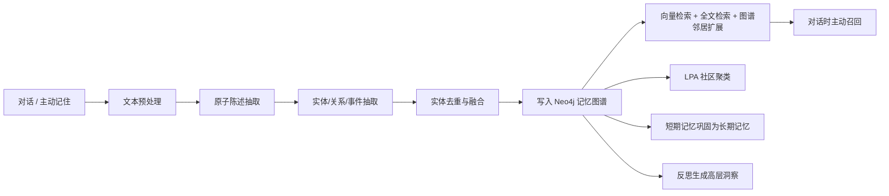
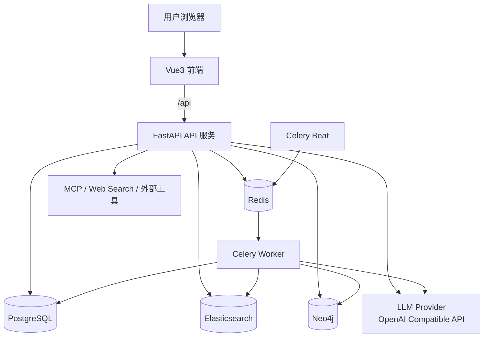

# MyFriend（知己）

> 一个面向个人长期陪伴场景的 AI 知识库与记忆助手。  
> MyFriend 会记录用户的重要信息，构建个人记忆图谱，在对话、知识检索、深度研究、群聊与定时任务中主动召回上下文，让 AI 更懂你、记得住、能持续协助你。

---

## 项目概览

MyFriend 是一个多用户 AI 助手系统，核心目标是把「对话助手」「个人知识库」「长期记忆」「Agent 工具编排」整合到同一个产品中。

项目采用前后端分离架构：

- **前端**：Vue 3 + TypeScript + Pinia + Vue Router + Tailwind CSS
- **后端**：FastAPI + SQLAlchemy + Celery
- **数据层**：PostgreSQL + Elasticsearch + Neo4j + Redis
- **AI 能力**：兼容 OpenAI 协议的对话模型、向量模型、多模态模型、重排模型、ASR 语音识别与联网搜索

用户可以在系统中配置自己的模型 API Key，上传文档/图片，进行知识库检索、记忆沉淀、智能对话、深度研究、多 Agent 群聊、定时任务和情绪音乐推荐。

---

## 核心功能

### 1. 智能对话

- 支持普通对话、SSE 流式输出、会话管理和历史消息查看
- 支持知识库、记忆、联网搜索、日期时间、定时任务等工具调用
- 支持图片上传、多模态问答、文件上传、语音转写
- 支持消息反馈、重新生成、对话分享

### 2. 个人知识库 RAG

- 支持多知识库管理
- 支持 PDF、Word、Markdown、TXT、HTML、网页链接等资料导入
- 支持父子分块、向量化、Elasticsearch 混合检索
- 支持 BM25 + 向量召回 + 可选 rerank 重排
- 支持文档预览、解析状态、重试解析、移动知识库、删除资料
- 支持图片资料上传、图片描述、图片检索与多模态理解

### 3. 长期记忆系统

MyFriend 的记忆系统不是简单保存聊天记录，而是把用户信息沉淀成可检索、可聚类、可纠错的个人知识图谱。

记忆链路大致如下：



主要能力包括：

- 对话内容中的实体、关系、事件抽取
- 记忆实体去重与融合
- Neo4j 记忆图谱构建
- 个人画像、记忆列表、记忆详情、时间线
- 记忆图谱可视化
- 记忆检索、图谱邻居扩展、主动召回
- LPA 标签传播社区聚类
- 短期记忆到长期记忆的自动巩固
- 反思引擎生成高层洞察
- 人类反馈纠错与记忆删除

### 4. Agent 与工具系统

- 支持全局 Agent 配置
- 支持角色卡 Persona 和角色组 Persona Group
- 支持技能 Skills 配置、内置技能模板、提示词优化
- 支持工具开关、MCP Server 配置、工具同步与测试
- 强模型支持 function calling，弱模型可降级为 ReAct 风格工具调用
- 支持 Agent 执行轨迹 Trace 查看和成本统计

### 5. 多 Agent 群聊

- 支持创建群聊、邀请加入、成员管理
- 支持多角色 Agent 在群聊中流式发言
- 支持群聊工具开关
- 支持群聊消息清理、用户主动发言和事件流

### 6. 深度研究

- 支持研究主题优化
- 支持深度研究流式生成
- 支持报告列表、详情、事件流查看
- 支持报告保存到知识库
- 支持报告分享和公开访问
- 支持导出 DOCX

### 7. 定时任务与主动关心

- 支持创建 Agent 定时任务
- 支持启停任务、立即运行、运行历史
- 支持未读任务结果计数
- 支持通知渠道配置和测试
- 可用于每日回顾、主动提醒、周期性研究等场景

### 8. 情绪与音乐推荐

- 支持对话情绪分析
- 支持 valence-arousal 情绪画像
- 支持情绪趋势、情绪分布和情绪记录
- 支持音乐曲库、歌曲上传、歌曲情绪打标
- 支持基于当前情绪的音乐推荐
- 支持咪咕搜索和播放记录

### 9. 收藏、搜索与看板

- 全局搜索
- 收藏夹管理
- 首页概览
- 记忆统计
- 每日回顾
- Agent briefing
- Loop health 状态展示

---

## 技术栈

### 前端

| 技术 | 说明 |
| --- | --- |
| Vue 3 | 前端框架 |
| TypeScript | 类型系统 |
| Pinia | 状态管理 |
| Vue Router | 路由管理 |
| Vite | 开发与构建工具 |
| Tailwind CSS | 样式系统 |
| Axios | HTTP 请求 |
| ECharts | 图谱和可视化 |

### 后端

| 技术 | 说明 |
| --- | --- |
| FastAPI | Python Web 框架 |
| SQLAlchemy Async | 异步 ORM |
| Alembic | 数据库迁移 |
| PostgreSQL | 关系数据库 |
| Elasticsearch | 全文检索与向量检索 |
| Neo4j | 记忆知识图谱 |
| Redis | 缓存、消息队列 |
| Celery | 异步任务与定时任务 |
| httpx / aiohttp | 外部 HTTP 调用 |
| LangChain | Agent 与模型适配 |
| PyMuPDF / python-docx | 文档解析 |

---

## 系统架构



---

## 目录结构

```text
myfriend/
├── api/                         # FastAPI 后端
│   ├── app/
│   │   ├── controllers/          # 路由层，统一挂载到 /api
│   │   ├── services/             # 业务编排层
│   │   ├── repositories/         # 数据访问层
│   │   ├── models/               # SQLAlchemy ORM 模型
│   │   ├── schemas/              # Pydantic 请求/响应模型
│   │   ├── core/                 # 横切能力：LLM、RAG、记忆、Agent、音乐、存储等
│   │   ├── tasks/                # Celery 异步任务
│   │   ├── db/                   # PostgreSQL / ES / Neo4j / Redis 连接
│   │   └── main.py               # FastAPI 应用入口
│   ├── migrations/               # Alembic 迁移脚本
│   ├── pyproject.toml            # Python 依赖，使用 uv 管理
│   └── run.py                    # 本地启动入口
│
├── web/                          # Vue3 前端
│   ├── src/
│   │   ├── api/                  # 前端接口封装
│   │   ├── pages/                # 页面组件
│   │   ├── components/           # 通用组件
│   │   ├── layouts/              # 页面布局
│   │   ├── router/               # Vue Router
│   │   ├── stores/               # Pinia 状态
│   │   └── style.css             # 全局样式
│   ├── package.json
│   └── vite.config.ts
│
├── docker/
│   └── es/                       # Elasticsearch IK 中文分词镜像
├── intro/                        # 项目介绍页
├── docker-compose.yml            # 开发环境 compose
├── docker-compose.prod.yml       # 生产环境 compose 覆盖配置
└── .env.example                  # 根环境变量示例
```

---

## 环境要求

建议版本：

- Node.js >= 20
- Python >= 3.12
- uv
- Docker / Docker Compose
- PostgreSQL 16
- Elasticsearch 8.17
- Neo4j 5.x
- Redis 7.x

安装 uv：

```bash
pip install uv
```

或参考 uv 官方安装方式。

---

## 快速启动：本地开发模式

推荐本地开发时使用 Docker 启动数据库、中间件，前后端分别本地运行。

### 1. 启动基础服务

在项目根目录复制环境变量：

```bash
copy .env.example .env
```

macOS / Linux：

```bash
cp .env.example .env
```

然后编辑 `.env`，至少修改：

```env
JWT_SECRET=your-random-secret
FERNET_KEY=your-fernet-key
```

生成 `FERNET_KEY`：

```bash
cd api
uv run python -c "from cryptography.fernet import Fernet; print(Fernet.generate_key().decode())"
```

回到根目录启动基础服务：

```bash
docker compose up -d postgres elasticsearch neo4j redis
```

### 2. 启动后端

```bash
cd api
copy .env.example .env
```

macOS / Linux：

```bash
cp .env.example .env
```

安装依赖：

```bash
uv sync
```

执行数据库迁移：

```bash
uv run alembic upgrade head
```

启动 API：

```bash
uv run python run.py
```

后端默认地址：

```text
http://localhost:8000
```

验证接口：

```text
GET http://localhost:8000/api/hello
GET http://localhost:8000/api/health
```

接口文档：

```text
http://localhost:8000/docs
```

### 3. 启动 Celery Worker

另开一个终端：

```bash
cd api
uv run celery -A app.celery_app.celery_app worker -l info -Q default,parse,memory,beat,research --concurrency=10
```

Windows 推荐使用：

```bash
uv run celery -A app.celery_app.celery_app worker -l info -Q default,parse,memory,beat,research --pool=solo
```

### 4. 启动 Celery Beat

另开一个终端：

```bash
cd api
uv run celery -A app.celery_app.celery_app beat -l info
```

### 5. 启动前端

```bash
cd web
npm install
copy .env.example .env
npm run dev
```

macOS / Linux：

```bash
cd web
npm install
cp .env.example .env
npm run dev
```

前端默认地址：

```text
http://localhost:5173
```

Vite 会把以下路径代理到后端：

```text
/api
/openapi.json
/docs
```

---

## Docker Compose 启动说明

项目根目录提供了：

- `docker-compose.yml`
- `docker-compose.prod.yml`

开发环境：

```bash
docker compose up -d
```

生产环境：

```bash
docker compose -f docker-compose.yml -f docker-compose.prod.yml up -d
```

> 注意：当前压缩包中 `web/` 目录未包含 `Dockerfile` 和 nginx 配置文件。如果直接执行完整 `docker compose up --build`，`web` 服务可能会因为无法 build 而失败。  
> 本地开发建议优先使用上面的「基础服务 Docker + 前后端本地运行」方式。若要完整容器化部署，需要为 `web/` 补充前端构建镜像和 nginx 静态文件服务配置。

---

## 模型配置说明

MyFriend 不把模型 API Key 写在 `.env` 中。模型 Key 由用户登录后在前端「设置 → 模型」页面配置，并通过 Fernet 加密后保存到数据库。

### 支持的模型类型

| 类型 | 用途 |
| --- | --- |
| `chat` | 对话、记忆抽取、Agent、深度研究等 |
| `embedding` | 知识库和记忆的向量检索 |
| `multimodal` | 图片理解、多模态问答 |
| `rerank` | 检索结果重排 |
| `websearch` | 联网搜索 |
| `asr` | 语音识别 |

### 常见 Provider Base URL

| Provider | Base URL |
| --- | --- |
| OpenAI | `https://api.openai.com/v1` |
| 通义千问 / DashScope | `https://dashscope.aliyuncs.com/compatible-mode/v1` |
| DeepSeek | `https://api.deepseek.com` |
| 智谱 AI | `https://open.bigmodel.cn/api/paas/v4` |
| 豆包 / 火山方舟 | `https://ark.cn-beijing.volces.com/api/v3` |

推荐配置示例：

| 类型 | Provider | 模型 |
| --- | --- | --- |
| chat | deepseek | `deepseek-chat` |
| embedding | zhipu | `embedding-3` |
| multimodal | qwen | `qwen-vl-plus` |
| rerank | qwen | `gte-rerank-v2` |

注意事项：

- `Base URL` 只填写根地址，不要填写 `/chat/completions` 或 `/embeddings`
- 不要复制带空格、Tab、换行的 URL
- 如果测试模型连接时报 `Invalid non-printable ASCII character in URL`，通常是 URL 前后存在隐藏空白字符，需要重新输入或清理数据库字段
- `embedding` 维度需要与 `EMBEDDING_DIMS` 保持一致，默认是 `1024`

---

## 环境变量

### 根目录 `.env`

根目录 `.env` 主要给 Docker Compose 使用。

| 变量 | 说明 |
| --- | --- |
| `APP_NAME` | 应用名 |
| `APP_ENV` | 环境，development / production |
| `APP_DEBUG` | 是否调试模式 |
| `CORS_ORIGINS` | 前端允许来源 |
| `JWT_SECRET` | JWT 签名密钥 |
| `FERNET_KEY` | API Key 加密密钥 |
| `POSTGRES_USER` | PostgreSQL 用户 |
| `POSTGRES_PASSWORD` | PostgreSQL 密码 |
| `POSTGRES_DB` | PostgreSQL 数据库 |
| `NEO4J_USER` | Neo4j 用户 |
| `NEO4J_PASSWORD` | Neo4j 密码 |

### `api/.env`

后端本地开发使用 `api/.env`。

| 变量 | 说明 |
| --- | --- |
| `APP_HOST` / `APP_PORT` | API 监听地址和端口 |
| `POSTGRES_HOST` / `POSTGRES_PORT` | PostgreSQL 地址 |
| `ES_HOST` | Elasticsearch 地址 |
| `NEO4J_URI` | Neo4j Bolt 地址 |
| `REDIS_URL` | Redis 地址 |
| `CELERY_BROKER_URL` | Celery Broker |
| `CELERY_RESULT_BACKEND` | Celery 结果后端 |
| `STORAGE_BACKEND` | 文件存储后端，`local` / `oss` |
| `STORAGE_DIR` | 本地文件存储目录 |
| `OSS_*` | 阿里云 OSS 配置 |
| `LOG_LEVEL` | 日志级别 |
| `EMBEDDING_DIMS` | 向量维度 |

---

## 常用命令

### 前端

```bash
cd web

npm install
npm run dev
npm run build
npm run preview
npm run type-check
```

### 后端

```bash
cd api

uv sync
uv run python run.py
uv run alembic upgrade head
uv run ruff check .
```

### Celery

```bash
cd api

uv run celery -A app.celery_app.celery_app worker -l info -Q default,parse,memory,beat,research --concurrency=10
uv run celery -A app.celery_app.celery_app beat -l info
```

### Docker

```bash
docker compose up -d postgres elasticsearch neo4j redis
docker compose logs -f api
docker compose down
```

---

## API 模块概览

所有接口默认挂载在 `/api` 前缀下。

| 模块 | 前缀 | 说明 |
| --- | --- | --- |
| 健康检查 | `/hello`, `/health` | 服务可用性和存储连通性 |
| 用户认证 | `/auth` | 注册、登录、刷新令牌、资料、头像 |
| 模型配置 | `/models` | 模型 CRUD、测试连接、设默认 |
| 对话 | `/conversations`, `/chat` | 会话、消息、流式对话、上传、反馈 |
| 群聊 | `/groups` | 群聊、邀请、成员、多 Agent 流式 |
| 知识库 | `/knowledge-bases`, `/documents` | 知识库、文档、解析、检索 |
| 图片 | `/images` | 图片上传、检索、移动、删除 |
| 记忆 | `/memories` | 记住、检索、画像、社区、图谱、反思 |
| Agent | `/agent-config`, `/personas`, `/persona-groups` | Agent 设置、角色卡、角色组 |
| 技能与工具 | `/skills`, `/tools`, `/tools/mcp` | 技能、工具开关、MCP Server |
| 深度研究 | `/research` | 研究生成、报告、分享、导出 |
| 任务 | `/agent-tasks` | 定时任务、运行记录、启停 |
| 推送 | `/notify-channels` | 通知渠道管理 |
| 情绪 | `/emotion` | 情绪画像、趋势、分布、记录 |
| 音乐 | `/music` | 推荐、曲库、上传、搜索、播放 |
| 搜索 | `/search` | 全局搜索 |
| 收藏 | `/favorites` | 收藏夹 |
| 执行轨迹 | `/traces` | Agent trace 和成本统计 |
| 公开分享 | `/public/shares`, `/public/report-shares` | 对话分享和报告分享公开访问 |

---

## 数据库迁移

修改 ORM 模型后：

```bash
cd api
uv run alembic revision --autogenerate -m "your migration message"
uv run alembic upgrade head
```

注意：

- 新增模型后需要在 `api/app/models/__init__.py` 中导入，否则 Alembic 可能无法自动发现
- 添加非空字段时应考虑存量数据回填
- 后端启动时会尝试自动执行 `alembic upgrade head`，但本地开发建议手动执行一次确认迁移状态

---

## 异步任务说明

| 队列 | 用途 |
| --- | --- |
| `parse` | 文档解析、图片处理、歌曲处理 |
| `memory` | 记忆萃取、情绪分析 |
| `research` | 深度研究任务 |
| `beat` | 定时任务、每日回顾、聚类、巩固、反思 |
| `default` | 默认任务 |

Celery Beat 中可承载：

- 每日回顾
- 记忆全量社区聚类
- 记忆巩固
- 反思生成洞察
- Agent 定时任务调度

---

## 开发规范

后端采用严格分层：

```text
Controller → Service → Repository → Model / DB
```

约定：

- Controller 只做路由、参数校验和响应包装
- Service 负责业务逻辑和流程编排
- Repository 只负责数据访问，不写业务规则
- 所有用户数据查询都必须带 `user_id` 过滤
- 业务错误使用 `BizError`
- 响应格式保持统一
- 日志避免输出明文 API Key、Token、密码等敏感信息

前端约定：

- 页面放在 `web/src/pages`
- 接口封装放在 `web/src/api`
- 全局状态放在 `web/src/stores`
- 公共 UI 组件放在 `web/src/components`
- 路由统一维护在 `web/src/router/index.ts`

---

## 常见问题

### 1. 测试模型时报 URL 非法

错误示例：

```text
httpx.InvalidURL: Invalid non-printable ASCII character in URL, '\t' at position 0
```

原因通常是 `Base URL` 前面复制进了隐藏的 Tab、空格或换行。

解决方式：

1. 在前端模型配置页删除 Base URL 后重新手动输入
2. 确认只填写根地址，例如 `https://api.deepseek.com`
3. 如仍失败，可清理数据库中 `model_configs.base_url` 字段前后的空白

### 2. 文档解析失败

优先检查：

- 是否配置了默认 `chat` 模型
- 是否配置了默认 `embedding` 模型
- `embedding` 维度是否与 `EMBEDDING_DIMS` 一致
- Celery Worker 是否启动
- Elasticsearch 是否健康
- 模型 Base URL 是否存在隐藏空白字符

### 3. 前端请求后端失败

检查：

- 后端是否运行在 `http://localhost:8000`
- 前端是否运行在 `http://localhost:5173`
- `vite.config.ts` 中代理是否指向正确后端
- 后端 `CORS_ORIGINS` 是否包含前端地址
- 浏览器 localStorage 中 token 是否过期

### 4. Docker Compose 前端服务 build 失败

当前项目包中可能缺少 `web/Dockerfile`。可以先使用本地前端开发模式：

```bash
cd web
npm run dev
```

若要完整部署，需要补充前端 Dockerfile 和 nginx 配置。

---

## License

本项目当前未声明开源许可证。若需要公开发布，请先补充 `LICENSE` 文件。
